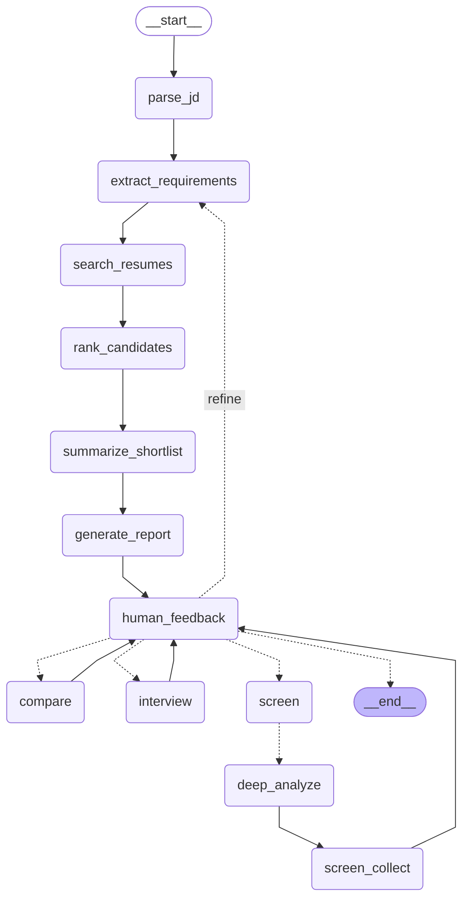

# Matching Agent — State Machine

```mermaid
---
config:
  flowchart:
    curve: linear
---
graph TD;
	__start__([<p>__start__</p>]):::first
	parse_jd(parse_jd)
	extract_requirements(extract_requirements)
	search_resumes(search_resumes)
	rank_candidates(rank_candidates)
	summarize_shortlist(summarize_shortlist)
	generate_report(generate_report)
	human_feedback(human_feedback)
	compare(compare)
	interview(interview)
	screen(screen)
	deep_analyze(deep_analyze)
	screen_collect(screen_collect)
	__end__([<p>__end__</p>]):::last
	__start__ --> parse_jd;
	compare --> human_feedback;
	deep_analyze --> screen_collect;
	extract_requirements --> search_resumes;
	generate_report --> human_feedback;
	human_feedback -.-> __end__;
	human_feedback -.-> compare;
	human_feedback -. &nbsp;refine&nbsp; .-> extract_requirements;
	human_feedback -.-> interview;
	human_feedback -.-> screen;
	interview --> human_feedback;
	parse_jd --> extract_requirements;
	rank_candidates --> summarize_shortlist;
	screen -.-> deep_analyze;
	screen_collect --> human_feedback;
	search_resumes --> rank_candidates;
	summarize_shortlist --> generate_report;
	classDef default fill:#f2f0ff,line-height:1.2
	classDef first fill-opacity:0
	classDef last fill:#bfb6fc

```
